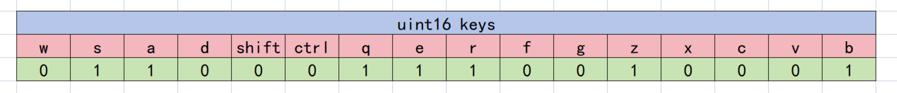

# 遥控器模块

## 1. 模块简介
本模块是遥控器封装类，有 DT7、VT13、FS_I6X 三个类，内置 UART 实例与遥控器进行通信。

## 2. 整体结构
遥控器为全局单例类，通过 UART5 串口接收遥控器的数据。

初始化后，实例会注册并打开串口中断接收，并在每次进入中断后调用 `parseFrame()` 进行解包。

使用时通过各种上层 getter 函数和 is 函数判断。

*若用户需要加入自己编写的其他电机类，请最好也按照这个结构来。*

## 3. 使用方法
使用上，三种遥控器均是先用 `init()` 方法初始化，然后在上层 app 使用各种 getter 和 is 函数进行判断。

下面介绍三种遥控器各自具体的协议：

### DT7
其具体协议包如下：
```c++
// 位域结构体，用于快速解析
struct Key_t
{
    union
    {
        struct
        {
            uint16_t w : 1;
            uint16_t s : 1;
            uint16_t a : 1;
            uint16_t d : 1;
            uint16_t shift : 1;
            uint16_t ctrl : 1;
            uint16_t q : 1;
            uint16_t e : 1;
            uint16_t r : 1;
            uint16_t f : 1;
            uint16_t g : 1;
            uint16_t z : 1;
            uint16_t x : 1;
            uint16_t c : 1;
            uint16_t v : 1;
            uint16_t b : 1;
        };
        uint16_t keys{0};
    };
};
// 遥控器完整数据
struct RCData
{
    struct
    {
        int16_t rocker_r_h; // 右摇杆水平（horizontal）
        int16_t rocker_r_v; // 右遥感竖直（vertical）
        int16_t rocker_l_h; // 左遥感水平
        int16_t rocker_l_v; // 左遥感竖直
        int16_t dial; // 拨轮
        uint8_t sw_left; // 左拨杆
        uint8_t sw_right; // 右拨杆
    } rc;

    struct
    {
        int16_t x; // 鼠标水平移动
        int16_t y; // 鼠标竖直移动
        int16_t z; // 鼠标滚轮
        uint8_t press_l[2]; // 左键 [MOUSE_PRESS, MOUSE_CLICK]
        uint8_t press_r[2]; // 右键 [MOUSE_PRESS, MOUSE_CLICK]
    } mouse;

    Key_t key[4]; // 键盘按键 [KEY_PRESS, KEY_CLICK, KEY_PRESS_WITH_CTRL, KEY_PRESS_WITH_SHIFT]
    // uint8_t key_count[3][16];//统计总按下次数的键，但是看起来没什么用
};
```

`rc` 字段是遥控器本身的 Channel；\
`mouse` 字段是鼠标输入的 Channel；\
`key` 是键盘输入的 Channel。

> 这里的 `Key_t` 使用了位域分配，意思是一个 uint16 数据，每一 bit 代表一个按键的状态。
> 具体如下图所示：
> 

实际使用中，一般直接调用上层方法，并配合索引宏定义：
```c++
// 键盘按键索引
namespace DT7Key
{
    static constexpr uint8_t W = 0;
    static constexpr uint8_t S = 1;
    static constexpr uint8_t A = 2;
    static constexpr uint8_t D = 3;
    static constexpr uint8_t SHIFT = 4;
    static constexpr uint8_t CTRL = 5;
    static constexpr uint8_t Q = 6;
    static constexpr uint8_t E = 7;
    static constexpr uint8_t R = 8;
    static constexpr uint8_t F = 9;
    static constexpr uint8_t G = 10;
    static constexpr uint8_t Z = 11;
    static constexpr uint8_t X = 12;
    static constexpr uint8_t C = 13;
    static constexpr uint8_t V = 14;
    static constexpr uint8_t B = 15;
} // namespace DT7Key
// 拨杆状态
static constexpr uint8_t RC_SW_UP = 1;
static constexpr uint8_t RC_SW_MID = 3;
static constexpr uint8_t RC_SW_DOWN = 2;
// 鼠标状态索引
static constexpr uint8_t MOUSE_PRESS = 0;
static constexpr uint8_t MOUSE_CLICK = 1;
// 键盘状态索引
static constexpr uint8_t KEY_PRESS = 0;
static constexpr uint8_t KEY_CLICK = 1;
static constexpr uint8_t KEY_PRESS_WITH_CTRL = 2;
static constexpr uint8_t KEY_PRESS_WITH_SHIFT = 3;
```
DT7 的主要方法如下：

|         方法名称          |             输入类型             |  输出类型   |          描述          |
|:---------------------:|:----------------------------:|:-------:|:--------------------:|
|        `init`         | UARTInstance::Config or None |  None   |         初始化          |
|        `start`        |             None             |  None   |      开启对遥控器的接收       |
|        `stop`         |             None             |  None   |      停止对遥控器的接收       |
|    `getLeftSwitch`    |             None             | RC_SW_* |       获取左拨杆的状态       |
|   `getRightSwitch`    |             None             | RC_SW_* |       获取右拨杆的状态       |
| `isMouseLeftPressed`  |             None             |  bool   |       判断左键是否按下       |
| `isMouseLeftClicked`  |             None             |  bool   |       判断左键是否单击       |
| `isMouseRightPressed` |             None             |  bool   |       判断右键是否按下       |
| `isMouseRightClicked` |             None             |  bool   |       判断右键是否单击       |
|    `isKeyPressed`     |            DT7Key            |  bool   |      判断键盘按键是否按下      |
|    `isKeyClicked`     |            DT7Key            |  bool   |      判断键盘按键是否单击      |
| `isCtrlComboPressed`  |            DT7Key            |  bool   | 判断键盘按键是否与 Ctrl 组合按下  |
| `isShiftComboPressed` |            DT7Key            |  bool   | 判断键盘按键是否与 Shift 组合按下 |
|       `getData`       |             None             | RCData  |  获取当前所有按键值（不推荐直接用）   |
|    `isFrameValid`     |             None             |  None   |      判断当前帧是否有效       |
|      `isOnline`       |             None             |  None   |      判断遥控器是否在线       |
|   `debugPrintKeys`    |             None             |  None   |   打印出键盘按键的按下情况以供调试   |
| `debugPrintComboKeys` |             None             |  None   |  打印出键盘按键组合的按下情况以供调试  |

### VT13
VT13 的用法与 DT7 基本一致，仅在协议包上有些许变化：

```c++
enum ModeSwitch : uint8_t { MODE_C = 0, MODE_N = 1, MODE_S = 2 };

struct Key_t
{
    union
    {
        struct
        {
            uint16_t w : 1, s : 1, a : 1, d : 1, shift : 1, ctrl : 1, q : 1, e : 1,
                r : 1, f : 1, g : 1, z : 1, x : 1, c : 1, v : 1, b : 1;
        };

        uint16_t keys{0};
    };
};

struct RCData
{
    struct
    {
        // 注意：VT13 的通道顺序（相对 DT7/DBUS 有差异）：
        // ch0: 右水平, ch1: 右竖直, ch2: 左竖直, ch3: 左水平
        int16_t rocker_r_h; // ch0 - 右水平
        int16_t rocker_r_v; // ch1 - 右竖直
        int16_t rocker_l_v; // ch2 - 左竖直
        int16_t rocker_l_h; // ch3 - 左水平
        int16_t dial; // 拨轮（同样 11 位，范围同上）
        uint8_t mode_switch; // 0/1/2 -> C/N/S
        uint8_t pause; // 0/1
        uint8_t btn_left; // 自定义左 0/1
        uint8_t btn_right; // 自定义右 0/1
        uint8_t trigger; // 扳机 0/1
    } rc;

    struct
    {
        int16_t x;
        int16_t y;
        int16_t z; // 滚轮速度（有正负）
        uint8_t press_l[2]; // [PRESS, CLICK]
        uint8_t press_r[2];
        uint8_t press_m[2];
    } mouse;

    Key_t key[4]; // [PRESS, CLICK, PRESS_WITH_CTRL, PRESS_WITH_SHIFT]
};
```

上层方法上主要多出：

| 方法名称                   | 输入类型 | 输出类型 | 描述       |
|------------------------|------|------|----------|
| `isMouseMiddlePressed` | None | bool | 判断中键是否按下 |
| `isMouseMiddleClicked` | None | bool | 判断中键是否点击 |

*DT7 的上层方法在 VT13 中均可使用。*

### FS_I6X
具体协议包如下：

```c++
enum class SwitchStatus : uint8_t
{
    HIGH = 0,
    MIDDLE = 1,
    LOW = 2,
};

struct RCData
{
    int16_t rocker_l_h = 0;
    int16_t rocker_l_v = 0;
    int16_t rocker_r_h = 0;
    int16_t rocker_r_v = 0;
    SwitchStatus switch_A = SwitchStatus::HIGH;
    SwitchStatus switch_B = SwitchStatus::HIGH;
    SwitchStatus switch_C = SwitchStatus::HIGH;
    SwitchStatus switch_D = SwitchStatus::HIGH;
    int16_t knob_l = 0;
    int16_t knob_r = 0;
};
```
FS 遥控器的协议较为简单，但尚未编写上层方法，只能通过 `getData()` 方法自行判断。

## 4. TODO
- 重构为风格统一的样式。
- 把一些宏定义封装成 enum。
- 完善上层方法的覆盖。
- Key_t struct 包 union 何意味。
- 优化键盘按键的判断逻辑。